# imgs.ai

*imgs.ai* is a fast, dataset-agnostic, deep visual search engine for digital art history based on neural network embeddings. Its main feature is the concept of "re-search": results from a search can immediately form the basis of another search. This allows the intuitive exploration of an image corpus, while results are continuously refined.

Please see the [project website](https://imgs.ai) for more information.

## Installation

1. Download and install the [Anaconda](https://www.anaconda.com/) or [Miniconda](https://docs.conda.io/en/latest/miniconda.html) (preferred) package manager and restart your shell to be able to use the `conda` command.
2. Clone (`git clone https://github.com/zentralwerkstatt/imgs.ai`) or [download](https://github.com/zentralwerkstatt/imgs.ai/archive/master.zip) this repository.
3. Change into the repository directory in a terminal, for instance with `cd imgs.ai`.
4. In the repository, run the [install.sh](install.sh) shell script with your preferred shell, e.g. under MacOS run `zsh install.sh`, under Linux run `bash install.sh`. This will create a conda environment named "imgs.ai" on your system. If you would like to install *imgs.ai* with GPU support, add the following parameter: `cudatoolkit=10.1`, where the version number is the version of your installed CUDA framework (see https://pytorch.org/ for more information).
5. To start imgs.ai, run the [run.sh](run.sh) shell script with your preferred shell, e.g. under MacOS run `zsh run.sh`. Add a port number as a parameter to change the default port from 5000 to a port of your choice.
7. Open a web browser and navigate to `127.0.0.1:5000` to see the interface. 

User management is turned off by default. To turn it on, change the `USER_MGMT` cariable in [config.py](config.py) to `True`. The admin user name and password is `hi@imgs.ai`. **Do not use this as-is on a public-facing server!**

## Models

We include the "MoMA" dataset in the repository for testing purposes only. The dataset is trained on all works in the <a href="https://www.moma.org/collection/">Museum of Modern Art, New York, collection</a> that are available online. This is a live dataset, images are pulled from the MoMA servers on request. Double-clicking an image opens the MoMA website work page.

## Limitations

- To train your own datasets, a **GPU** and at least **16 GB RAM** are strongly recommended.
- To use the "upload" function locally, at least **16 GB RAM** are recommended. Neither GPU nor this much RAM is required to simply browse the pre-trained models supplied by *imgs.ai*.
- When the "upload" function is used for the first time, several pre-trained networks are downloaded. This can take up to 10 minutes. Please do not refresh the browser, the terminal output will indicate when the download is completed.